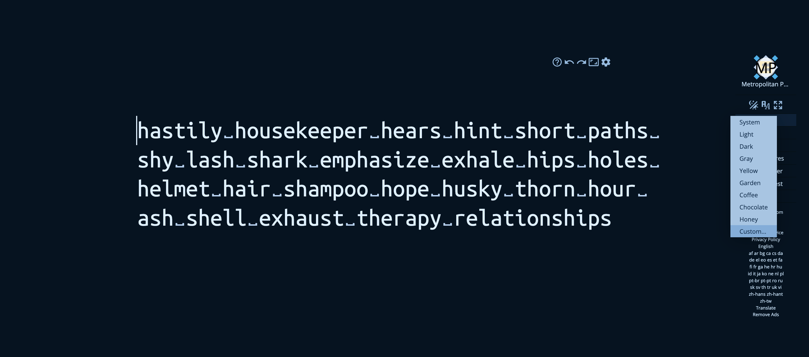
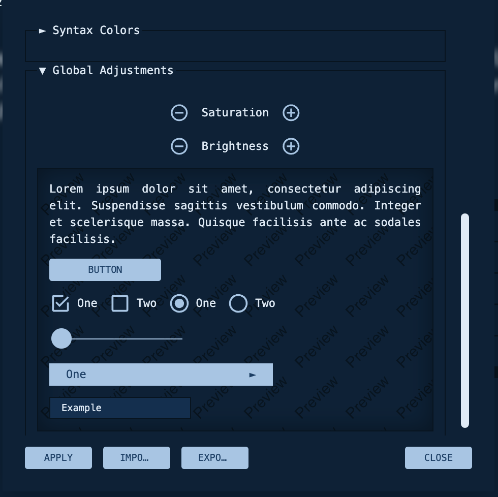

# Key br - Night owl Theme

1. Import the `night-owl.keybr-theme` into custom themes. Themes --> Custom --> Import --> Apply.

*Pro tip*: Use the `Global Adjustments` at the very bottom in theme configurations to increase or reduce the brightness.

## ... Happy Typing ...  
### Bye..👋

